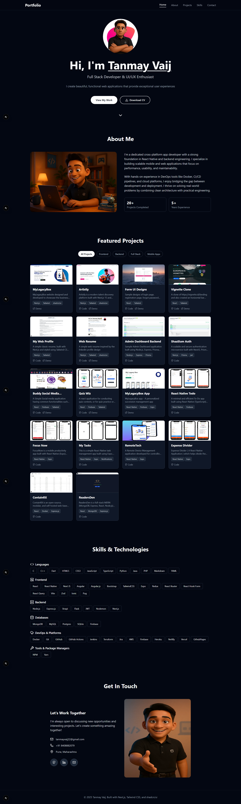

# 🌐 Tanmay Vaij - Developer Portfolio

Welcome to the codebase of my personal developer portfolio, built with **Next.js 15**, **Tailwind CSS**, and **ShadCN UI**. This portfolio showcases my projects, skills, and contact information with an elegant, modern UI and smooth user experience.



---

## 🚀 Features

- Responsive and animated landing page
- Skills and tools categorized with progress bars
- Project showcase with filtering (Frontend / Backend / Full Stack / Mobile)
- Smooth scroll navigation and mobile menu
- Contact form with interactive UI
- Downloadable resume and links to GitHub, LinkedIn, Email

---

## 🛠️ Tech Stack

**Frameworks & Libraries:**
- [Next.js](https://nextjs.org)
- [React](https://react.dev)
- [Tailwind CSS](https://tailwindcss.com)
- [ShadCN/UI](https://ui.shadcn.com)
- [Lucide Icons](https://lucide.dev)

---

## 📦 Installation

```bash
# Clone the repository
git clone https://github.com/tanmayvaij/portfolio.git
cd portfolio

# Install dependencies
npm install

# Run the dev server
npm run dev

# Open in browser
http://localhost:3000
````

---

## 🌐 Live Demo

[Visit My Portfolio →](https://tanmayvaij.vercel.app)
